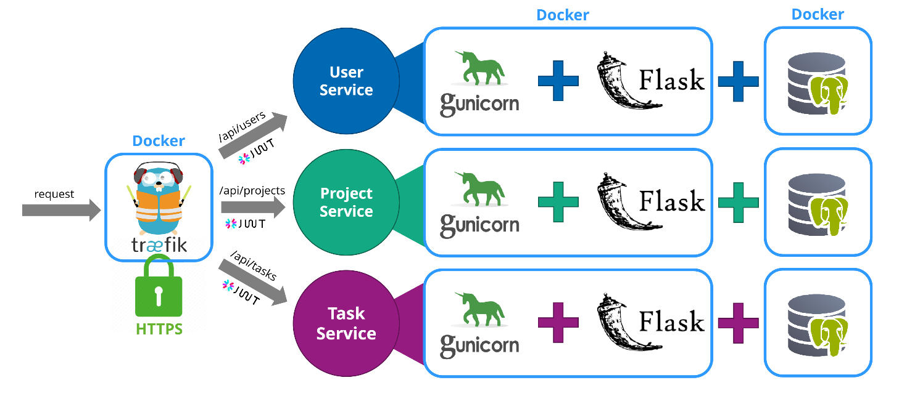
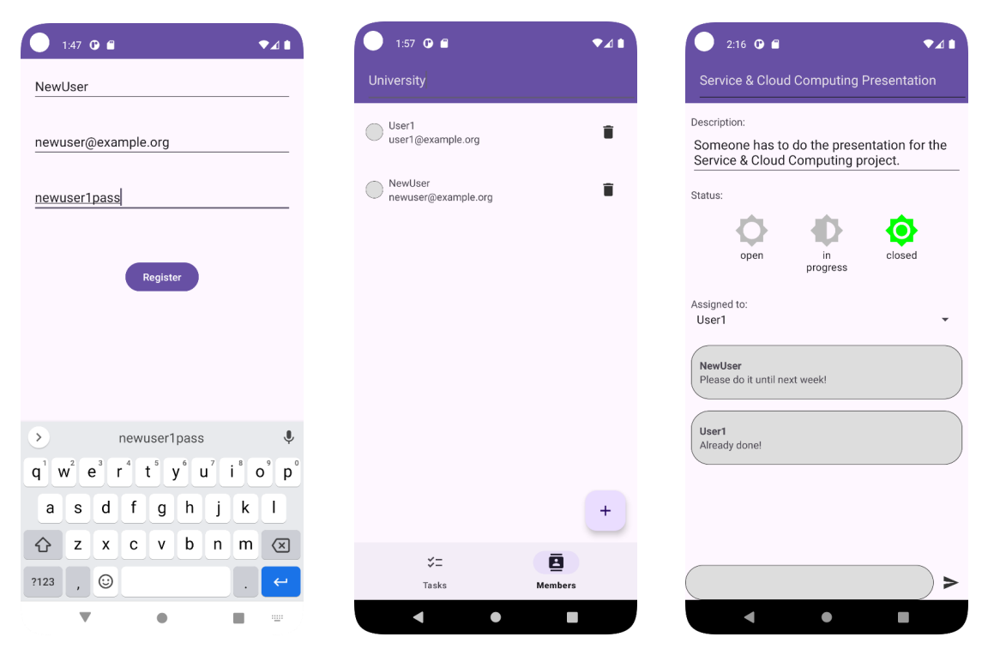

# Tasks Management App

This Android app and the associated API were created as part of the Service & Cloud Computing project at the TU Dresden.

Please have a look in the subfolders for the individual components of this project.

## Microservice Architecture

## Android App

